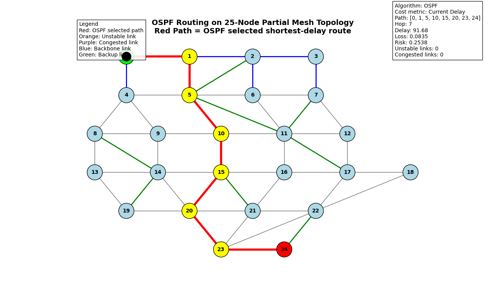
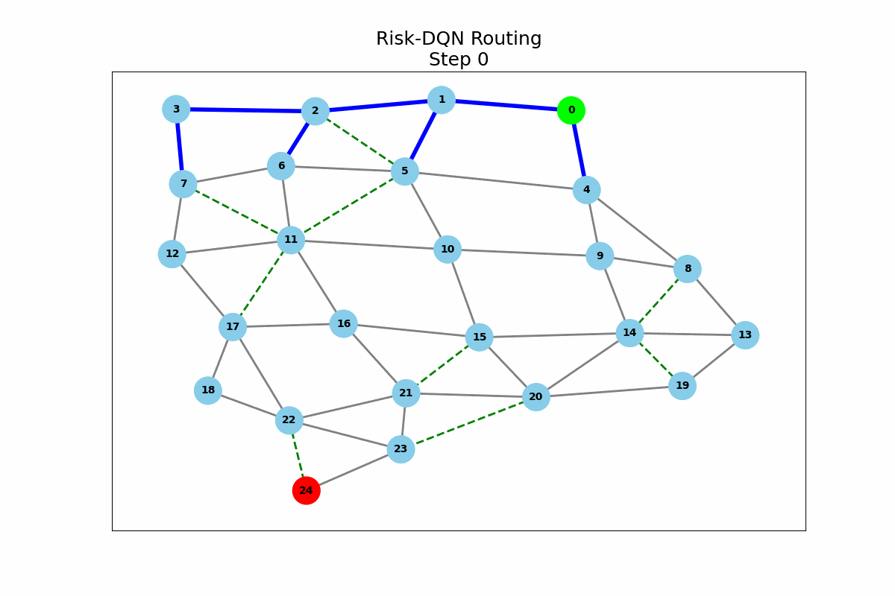
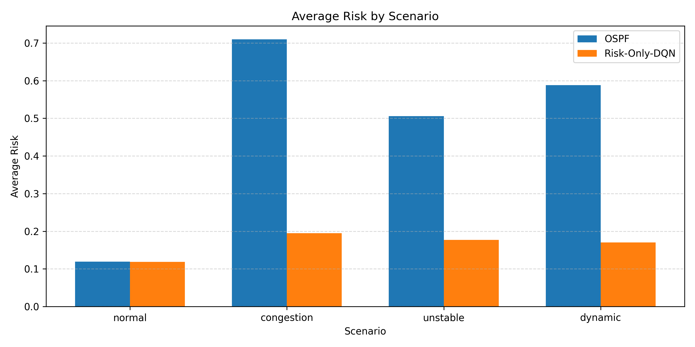

# Risk-Aware DQN Routing

> 시간에 따라 변하는 링크 위험도를 관찰하고, 혼잡·불안정 링크를 우회하는 경로를 학습하는 DQN 기반 네트워크 라우팅 시뮬레이션


이 프로젝트는 전통적인 **OSPF 라우팅**과 **Risk-Only DQN 라우팅**을 비교합니다. 단순 최단 경로가 아니라 링크 사용률, 혼잡 여부, 지연·손실의 시간적 변동성, 링크 유형을 하나의 위험도 점수로 결합하고, 에이전트가 누적 위험이 낮은 경로를 선택하도록 학습합니다.

## Demo

| OSPF | Risk-Aware DQN |
|:---:|:---:|
|  |  |

## 핵심 아이디어

링크 위험도는 다음 요소의 가중합으로 계산합니다.

```text
Risk = 0.35 × utilization
     + 0.30 × congestion
     + 0.15 × delay instability
     + 0.10 × loss instability
     + 0.10 × link-type prior
```

- **Action masking**: 현재 노드에서 실제로 이동할 수 있는 이웃 노드만 선택
- **Temporal risk**: 단일 시점 값뿐 아니라 최근 지연·손실의 변동성까지 반영
- **Multi-scenario training**: normal, congestion, unstable, dynamic 환경을 균등하게 학습
- **Generalization tests**: 학습에서 보지 못한 링크 구성과 동적 토폴로지에서 평가
- **Risk validation**: 위험 링크 식별 성능과 시간 윈도우 민감도를 별도 검증

## 실험 환경

기본 환경은 25개 노드에서 출발지 `0`부터 목적지 `24`까지 경로를 구성합니다.

| 시나리오 | 설명 |
|---|---|
| `normal` | 링크 상태가 전반적으로 안정적인 기준 환경 |
| `congestion` | 일부 경로에 높은 사용률과 혼잡이 발생하는 환경 |
| `unstable` | 지연과 패킷 손실의 변동성이 큰 환경 |
| `dynamic` | 에피소드별로 위험 경로와 우회 경로가 바뀌는 환경 |

DQN은 `512 → 256 → 128` 완전연결 네트워크를 사용하며, replay buffer와 target network를 이용해 학습합니다. 기본 학습 설정은 8,000 episodes, discount factor `0.99`, learning rate `3e-4`입니다.

## 주요 결과

저장된 기본 다중 시나리오 평가(`200 episodes/scenario`)에서는 두 방식 모두 100% 도착 성공률을 기록했습니다. 다만 위험 환경에서 Risk-Only DQN은 더 긴 우회 경로를 선택하면서 지연, 손실, 누적 위험을 낮췄습니다.

| Scenario | Method | Success | Avg. delay | Avg. loss | Avg. risk | Risky-link usage |
|---|---|---:|---:|---:|---:|---:|
| Normal | OSPF | 100% | 124.67 | 0.0092 | 0.1195 | 0.00% |
| Normal | Risk-Only DQN | 100% | 150.59 | 0.0079 | 0.1186 | 0.00% |
| Congestion | OSPF | 100% | 586.16 | 0.2971 | 0.7098 | 90.25% |
| Congestion | Risk-Only DQN | 100% | **281.58** | **0.0580** | **0.1950** | **14.29%** |
| Unstable | OSPF | 100% | 306.36 | 0.1995 | 0.5055 | 90.33% |
| Unstable | Risk-Only DQN | 100% | **225.32** | **0.0474** | **0.1770** | **14.29%** |
| Dynamic | OSPF | 100% | 577.72 | 0.2800 | 0.5878 | 79.55% |
| Dynamic | Risk-Only DQN | 100% | **348.68** | **0.0835** | **0.1700** | **21.46%** |

> 위 수치는 다중 시나리오 평가에서 산출된 시뮬레이션 결과입니다. 확률적 실험이므로 재실행 시 값이 달라질 수 있습니다.



## 빠른 시작

### 1. 저장소 준비

```bash
git clone <YOUR_REPOSITORY_URL>
cd <YOUR_REPOSITORY_NAME>/DQN_models_runner
```

### 2. 가상환경과 의존성 설치

```bash
python -m venv .venv

# Windows
.venv\Scripts\activate

# macOS / Linux
source .venv/bin/activate

pip install numpy pandas matplotlib networkx torch scipy imageio pillow
```

### 3. 사전 학습 모델 평가

저장소에 포함된 `risk_only_model_final.pth`를 사용해 OSPF와 DQN을 바로 비교할 수 있습니다.

```bash
python run_policy.py
```

평가 표와 그래프는 `results/`에 생성됩니다.

## 실험 재현

모든 명령은 `DQN_models_runner/` 디렉터리에서 실행합니다.

```bash
# 4개 시나리오에서 DQN 재학습
python risk_dqn_every_scenario.py

# 학습된 정책과 OSPF 비교
python run_policy.py

# 위험 링크 식별 및 통계 검증
python run_risk_identification_validation_v2.py

# 미관측 동적 토폴로지 생성 후 일반화 평가
python generate_unseen_topologies_dynamic.py
python run_topology_generalization_dynamic.py

# temporal window 민감도 및 스트레스 테스트
python run_window_temporal_stress.py

# 라우팅 애니메이션 생성
python animate_risk_dqn.py
python test_ospf.py
```

> 재학습은 기본 8,000 episodes로 설정되어 있어 CPU 환경에서는 시간이 오래 걸릴 수 있습니다. 빠른 확인이 목적이라면 `risk_dqn_every_scenario.py`의 `EPISODES` 값을 줄여 실행하세요.

## 프로젝트 구조

```text
.
├── README.md
├── results/                         # README 데모 이미지
└── DQN_models_runner/
    ├── risk_dqn_every_scenario.py   # DQN 학습 진입점
    ├── run_policy.py                # OSPF/DQN 다중 시나리오 평가
    ├── network_env.py               # 25-node 네트워크 환경
    ├── risk_calculator.py           # 링크 위험도 계산
    ├── topology.py                  # 기본 토폴로지 정의
    ├── run_risk_identification_validation_v2.py
    ├── run_topology_generalization_dynamic.py
    ├── run_window_temporal_stress.py
    ├── risk_only_model_final.pth    # 사전 학습 가중치
    ├── models/                      # 실험별 체크포인트
    ├── topologies_dynamic/          # 미관측 동적 토폴로지
    └── results/                     # CSV 및 시각화 결과
```

## 평가 지표

- **Success rate**: 목적지 노드 도달 비율
- **Delay / Loss**: 선택 경로의 누적 지연 및 패킷 손실
- **Risk**: 선택 경로의 누적 링크 위험도
- **Hop count**: 출발지에서 목적지까지 거친 링크 수
- **Unstable / Congested usage**: 전체 경로 중 불안정·혼잡 링크가 차지하는 비율

## 참고 사항

- 본 프로젝트는 **NetworkX 기반 네트워크 라우팅 시뮬레이션 연구 코드**입니다.
- 저장된 모델은 현재 상태 표현과 25-node 토폴로지에 맞춰져 있습니다. 환경이나 상태 차원을 바꾸면 재학습이 필요합니다.
- 일부 실험은 난수 시드를 고정하지만, 하드웨어와 라이브러리 버전에 따라 결과가 조금 달라질 수 있습니다.
- 프로젝트 루트의 ZIP 파일과 `.venv/`, `__pycache__/`는 GitHub 업로드에서 제외하는 것을 권장합니다.

## License

Copyright © 2026 한성대학교 학부연구생 연구실. All rights reserved.

자세한 내용은 [`LICENSE`](LICENSE) 파일을 참고하세요.
